# 🎵 Spotify AI-Powered Review Discovery Engine (PRDE)

An end-to-end AI-powered product analytics pipeline that ingests multi-source Spotify user reviews, scrubs PII locally, annotates feedback via a Groq-hosted LLM, clusters insights, and generates executive weekly pulse notes + a synchronized JSON dashboard. The application features a responsive Next.js frontend and a FastAPI backend with real-time log streaming over Server-Sent Events (SSE).

[](https://www.python.org/)
[](https://nextjs.org/)
[](https://fastapi.tiangolo.com/)
[](https://console.groq.com/)
[](#testing)

---

## 📋 Table of Contents

1. [System Overview & Architecture](#-system-overview--architecture)
2. [E2E Pipeline Workflow](#-e2e-pipeline-workflow)
3. [Phase-by-Phase Breakdown](#-phase-by-phase-breakdown)
4. [Directory Structure](#-directory-structure)
5. [Prerequisites](#-prerequisites)
6. [Setup & Installation](#-setup--installation)
7. [Running the Pipeline](#-running-the-pipeline)
8. [Testing Suite](#-testing-suite)
9. [Web UI: Run, Observe & Analyze](#-web-ui-run-observe--analyze)
10. [Key Design Decisions](#-key-design-decisions)
11. [Known Limitations](#-known-limitations)

---

## 🏗️ System Overview & Architecture

The project is organized into two primary blocks: the **Core Data Pipeline** (Python backend + FastAPI server) and the **Executive Web Dashboard** (Next.js App Router). The pipeline is deliberately split into 6 sequential phases so each can be run, tested, and verified in isolation.

```mermaid
graph TD
    %% Phase 1: Source Ingestion
    subgraph Ingestion ["Phase 1 - Ingestion and PII Scrubbing"]
        A1[Google Play Store] -->|google-play-scraper| B[IngestionManager]
        A2[Apple App Store] -->|iTunes RSS JSON Feed| B
        A3[Reddit Discussions] -->|r/spotify/new.json| B
        A4[Spotify Forums] -->|Playwright Scrape| B
        A5["Twitter/X via Nitter"] -->|Playwright Scrape| B
        A6[Trustpilot] -->|BeautifulSoup + Playwright| B
        B -->|"Emoji strip, Dedup, 5-word filter, Spam detect"| C1[raw_reviews.csv]
        C1 -->|PIIScrubber - Custom RegEx Masking| C2[reviews.csv]
    end

    %% Phase 2: LLM Optimization Strategy 4 + 5
    subgraph Phase2 ["Phase 2 - LLM-Optimized Annotation Strategy 4 and 5"]
        C2 -->|"sample_size=500, proportional by source and rating"| D1["Stratified Sampler<br/>S4: Minority-source floor guaranteed"]
        D1 -->|sampled reviews| D2["Gate Funnel<br/>S5: llama-3.1-8b-instant<br/>yes/no per review, batch=10"]
        D2 -->|no-signal reviews| D3["Auto-label: neutral + all-None<br/>Passive Listener, zero LLM cost"]
        D2 -->|signal reviews| D4["Full Classifier<br/>llama-3.3-70b-versatile<br/>7-dim Pydantic schema, batch=5"]
        D3 --> D5[annotated_reviews.json]
        D4 --> D5
        D5 --> D6["sample_coverage.json<br/>coverage_pct, gate_passed<br/>llm_calls_made, llm_calls_saved"]
    end

    %% Phase 3: Local Aggregation - No LLM
    subgraph Phase3 ["Phase 3 - Local Theme Aggregation, No LLM Calls"]
        D5 -->|ThemeDiscoverer| E1[Q1 - Discovery Barriers]
        D5 --> E2[Q2 - Recommendation Frustrations]
        D5 --> E3[Q3 - Listening Goals]
        D5 --> E4[Q4 - Repeat-Listening Drivers]
        D5 --> E5["Q5 - Underserved Segments + Severity Score + Discovery Challenges"]
        D5 --> E6[Q6 - Unmet Needs + Opportunity Score]
        E1 & E2 & E3 & E4 & E5 & E6 --> E7[analysis_results.json]
    end

    %% Phase 4+5: Reporting
    subgraph Reporting ["Phases 4 and 5 - Reporting and Orchestration"]
        E7 -->|PulseGenerator max 550 words| F1[weekly_pulse_note.md]
        E7 -->|JSONExporter + fallback padding| F2[data/dashboard_data.json]
        F2 -->|Phase 4 auto-sync| F3["frontend/public/dashboard_data.json"]
    end

    %% Backend Server
    subgraph Server ["FastAPI Server - src/server.py"]
        G1["GET /api/dashboard<br/>Reads data/dashboard_data.json"]
        G2["POST /api/run-pipeline<br/>Spawns main.py subprocess<br/>Streams stdout+stderr via SSE<br/>Heartbeat ping every 15s"]
    end

    %% Frontend
    subgraph Frontend ["Phase 6 - Next.js App Router frontend/"]
        H1[Next.js UI] -->|GET /api/dashboard| G1
        H1 -->|SSE EventSource Log Stream| G2
        H1 -->|Public JSON fallback dev mode| F3
        H1 --> H2["/dashboard - 7 metric sections"]
        H1 --> H3["/pulse-note - Markdown viewer"]
        H1 --> H4["/opportunities - PM cards"]
    end

    style Ingestion fill:#1e1e24,stroke:#444,stroke-width:1px
    style Phase2 fill:#1a1f30,stroke:#444,stroke-width:1px
    style Phase3 fill:#171c26,stroke:#444,stroke-width:1px
    style Reporting fill:#1a2324,stroke:#444,stroke-width:1px
    style Server fill:#1c1e20,stroke:#444,stroke-width:1px
    style Frontend fill:#15221b,stroke:#444,stroke-width:1px
```



---

### Component Descriptions

#### Phase 1 — Ingestion & PII Scrubbing (`src/ingestion/`)

| Component | Role |
|---|---|
| `scrapers.py` | Source-specific fetchers for 6 channels: Google Play via `google-play-scraper` library (1000 reviews), Apple App Store via iTunes RSS JSON feed, Reddit via `/r/spotify/new.json` feed, Spotify Forums and Twitter/X via Playwright browser automation, Trustpilot via BeautifulSoup HTML parsing. |
| `ingestor.py` | `IngestionManager` normalizes all sources into the unified schema (`source`, `date`, `title`, `text`, `rating`, `engagement`). Applies rule-based filters: emoji/symbol removal, deduplication by review text, short review sentence filtering (removes sentences with < 5 words), and spam detection (keywords, 5+ repeating characters, or 3+ consecutive repeating words) before saving per-source CSVs and merging into `raw_reviews.csv`. |
| `pii_scrubber.py` | `PIIScrubber` applies **five deterministic RegEx patterns** locally — no external API calls or ML models. Redacts: emails → `[EMAIL]`, IPv4 addresses → `[IP_ADDRESS]`, phone numbers → `[PHONE_NUMBER]`, Reddit handles → `[USER_HANDLE]`, social @handles → `[USER_HANDLE]`. Email masking runs before handle masking to prevent double-matching the `@` symbol. Outputs the clean `reviews.csv`. |

---

#### Phase 2 — Optimized LLM Annotation (`src/processing/`) — Strategy 4 + 5

Implements the two-strategy LLM optimization plan documented in `doc/llm_optimization.md` to reduce Groq API token consumption by ~85–90% versus naive full-dataset classification.

| Component | Role |
|---|---|
| `sampler.py` | **Strategy 4 — Stratified Sampling**: Slices `reviews.csv` to `sample_size=500` reviews using proportional allocation by `source` and `rating`. Minority-volume channels (`reddit`, `twitter`, `product_reviews`, `spotify_community`) are protected by a `min_floor_sources` guarantee — all their reviews are included before proportional cuts are made. |
| `review_processor.py` | **Strategy 5 — Two-Stage Gate Funnel**: Runs the sample through `llama-3.1-8b-instant` (small, cheap gate model) in batches of 10 for a `yes/no` signal decision per review. Reviews that receive `no` are auto-labelled as `neutral`/all-`None`/`Passive Listener` at zero LLM cost. Only gate-passed (`yes`) reviews are forwarded to the full `llama-3.3-70b-versatile` 7-dimension classifier in batches of 5. Saves `annotated_reviews.json` and `sample_coverage.json`. |
| `llm_client.py` | `GroqClient` initializes the Groq SDK from `config.yaml` (`model_name: llama-3.3-70b-versatile`, `temperature: 0.1`, `max_tokens: 4096`). Also wires in rate-limit config (`batch_size: 5`, `min_request_interval: 3s`, `max_retries: 5`, backoff up to 120s). |
| `review_processor.py` — `GroqRateLimiter` | Proactive token-per-minute (TPM) throttle: maintains a rolling 60-second window of token usage against a `12,000 TPM` budget. Sleeps automatically when the budget is approached, preventing 429 rate-limit errors mid-batch. |
| `review_processor.py` — `call_groq_with_retry` | Exponential-backoff retry wrapper (up to 5 attempts). Reads `Retry-After` headers when available. Distinguishes between per-minute 429s (retriable) and per-day TPD quota exhaustion (raises `GroqTokenDailyLimitError` immediately, no retry). |
| `schema.py` / `ReviewAnalysis` | Pydantic models with all 7 fields typed as strict `Literal` unions — zero free-text drift in LLM output. Validated via `model_validate_json()` on every Groq tool-call response. |

**7-Dimension Classification Schema** (all Literal-enforced, no free-text):

| Field | Allowed Labels |
|---|---|
| `sentiment` | `positive` · `neutral` · `negative` |
| `discovery_pain_points` | Repetitive Recommendations · Complex UI Navigation · Lack of Mood/Context Filters · Excessive Ad Interruptions · Poor Search Precision · None |
| `recommendation_frustrations` | Popularity Bias · Limited Genre Diversity · Over-Personalization · Podcast/Audiobook Clutter · Stale Algorithmic Mixes · None |
| `listening_goals_intentions` | Discovering Hidden Gems · Exploring New Genres · Mood/Activity-Based Listening · Relying on Familiar Playlists · Background/Passive Listening · None |
| `repeat_listening_signals` | Comfort Listening · Playlist Dependence · Lack of Trust in Recommendations · Choice Fatigue · Mood Mismatch · None |
| `unmet_needs` | Conversational AI Discovery · Context-Aware Recommendations · True Random Shuffle · Smart Playlist Refresh · Cross-Genre Discovery Mode · None |
| `segment_classification` | Mood-Based Explorers · Playlist Dependents · New Music Seekers · Genre Hoppers · Passive Listener |

---

#### Phase 3 — Local Theme Aggregation (`src/analysis/`)

* `ThemeDiscoverer` groups annotated reviews **entirely in Python** — **zero further LLM calls**.
* Runs 6 independent aggregation pipelines (Q1–Q6), each grouping by its dedicated Pydantic `Literal` field using predefined theme registries (`Q1_THEMES`, `Q2_THEMES`, etc.).
* Computes for every theme: **count**, **frequency %** (of total reviews), **average star rating**, and **evidence quotes** (top 2 texts per theme).
* Special metrics:
  * **Q5 Severity Score** = `(5.0 − avg_rating) × neg_pct` — highlights segments with both low ratings and high negative-review share.
  * **Q5 Discovery Challenges** — cross-aggregates `discovery_pain_points` (Q1 labels) within each user segment to produce a ranked top-3 list of discovery barriers per segment, with `count` and `frequency_within_segment`. This surfaces which specific discovery friction each persona faces most acutely.
  * **Q6 Opportunity Score** = `frequency × (6.0 − avg_rating)` — surfaces unmet needs that are both frequent and severely underserved.
* Outputs Top 3 insights per question to `data/processed/analysis_results.json`.

---

#### Phase 4 — Reporting (`src/reporting/`)

| Component | Role |
|---|---|
| `pulse_generator.py` | `PulseGenerator` compiles the **7-section markdown Weekly Pulse Note** strictly under **550 words**. It also uses the Groq LLM (`llama-3.3-70b-versatile`) to synthesize exactly 3 high-impact Product Opportunities (Problem, Evidence, Solution, Impact) using structured tool-calling. Quotes are capped at 40 characters and only included for the top-ranked item in each section to keep the note concise. |
| `json_exporter.py` | `JSONExporter` maps analysis results, the LLM-synthesized opportunities, and the pulse note text into `dashboard_data.json` (`week_ending`, `pulse_note_text`, `metrics`). Pads any metric section containing fewer than 3 items with clean fallback entries. Auto-syncs the output to `frontend/public/dashboard_data.json` for local dev mode. |

---

#### Backend Server (`src/server.py`)

* **FastAPI** REST server with CORS enabled for `localhost:3000` (and wildcard for deployment).
* `GET /api/dashboard` — reads `data/dashboard_data.json` from the project root and returns its content as JSON. Returns HTTP 404 if the pipeline has not been run yet.
* `POST /api/run-pipeline` — spawns `src/main.py --phase all` as a subprocess with `PYTHONUNBUFFERED=1`. Merges stdout+stderr into a single stream and emits each line as a JSON-encoded **Server-Sent Event**. On Unix/Linux uses `select()` with a **15-second heartbeat ping** (`: ping`) to prevent reverse-proxy idle-connection timeouts during long Groq rate-limit sleeps. Falls back to blocking `readline()` on Windows where `select()` is unavailable.

---

#### Frontend Dashboard (`frontend/`)

* **Next.js App Router** (v16, React 19, TypeScript) — zero external UI component libraries; pure vanilla CSS Modules only.
* **3 primary routes**: `/dashboard` (7 metric sections with inline `RatingBar` and `FrequencyBadge` using Recharts), `/pulse-note` (`react-markdown` renderer of `pulse_note_text`), `/opportunities` (structured PM opportunity cards with Problem / Evidence / AI Solution / Business Impact layout).
* **Data fetching**: Queries `GET /api/dashboard` via the FastAPI server. In local dev mode, falls back to reading `frontend/public/dashboard_data.json` directly if the backend is offline.
* **Trigger Pipeline** button in the Navbar opens a **Pipeline Execution Console** modal that subscribes to the SSE stream and renders pipeline logs line-by-line in real time. Automatically refreshes the dashboard page when the pipeline exits with code 0.

---

## 🔄 E2E Pipeline Workflow

The pipeline executes sequentially across 6 phases:

```
[Scrapers] ──► [Clean / Scrub] ──► [Stratified Sample S4] ──► [Gate Funnel S5]
                                                                      │
                                             ┌────────────────────────┘
                                             ▼
                                  [Full LLM Classify] ──► [Local Aggregation]
                                                                 │
                                             ┌───────────────────┘
                                             ▼
                              [Pulse Note ≤550w] + [JSON Export] ──► [Dashboard]
```

1. **Scrape**: Fetches raw posts and reviews from 6 public URLs across Google Play, App Store, Reddit, Spotify Forums, Twitter, and Trustpilot.
2. **Clean & Scrub**: Emojis are stripped, duplicate texts are dropped, and sentences with `< 5 words` or classified as spam are excluded. Custom RegEx patterns locally mask handles, emails, IPs, and phone numbers.
3. **Stratified Sampling (S4)**: Slices the dataset to the configured `sample_size` (default: 500), ensuring minority-volume channels (Reddit, Twitter, Forums) are never squeezed out by proportional cuts.
4. **LLM Gate Funnel (S5)**: A fast, low-cost `llama-3.1-8b-instant` classifier filters out noise reviews with a yes/no gate. Only signal-bearing reviews proceed to the primary `llama-3.3-70b-versatile` model for multi-label 7-dimension annotation.
5. **Local Aggregation**: `ThemeDiscoverer` groups annotated reviews by predefined labels across 6 business questions — no LLM calls. Computes counts, frequencies, ratings, Severity scores, and Opportunity scores entirely in Python.
6. **Executive Summary Synthesis**: `PulseGenerator` compiles a scannable **weekly report under 550 words** and synthesizes exactly 3 PM Product Opportunities via a Groq LLM call. `JSONExporter` then exports everything to `dashboard_data.json` (auto-synced to the frontend).

---

## 📖 Phase-by-Phase Breakdown

### Phase 0 — Project Scaffold & Environment Setup
* **Verification script:** `src/script/run_phase0.py`
* Registers folders (`data/raw/`, `data/processed/`, `src/`, `tests/`, `doc/`), parses configuration directories in `config.yaml`, checks `.env` configuration, and validates that all SDK dependencies are imported correctly.

### Phase 1 — Data Ingestion & PII Scrubbing
* **Verification script:** `src/script/run_phase1.py`
* Normalizes fields into the unified schema (`source`, `date`, `title`, `text`, `rating`, `engagement`).
* **Applies Rule-Based Cleaning & Filtering:**
  * **Emoji & Non-Standard Symbol Removal:** Strips emojis and non-unicode symbols to clean inputs.
  * **Short Review Sentence Filtering:** Removes individual sentences containing less than 5 words from review text. If the entire review becomes empty after filtering, the record is discarded.
  * **Spam Detection:** Automatically drops reviews that contain commercial spam keywords (e.g., *buy now, promo code, discount code, make money, click link*), excessive character repetitions (5+ consecutive repeating characters like `aaaaa` or `!!!!!`), or consecutive word repetitions (3+ repeating words).
  * **Deduplication:** Removes duplicate records based on the review `text` field.
* **Applies local PII Scrubbing:** Deterministic Regex masking strips emails, IPs, phone numbers, and user/social handles locally before writing raw CSVs per source, merging them into `data/raw/raw_reviews.csv`, and outputting clean records to `data/processed/reviews.csv`.

### Phase 2 — LLM Theme Extraction & Tagging
* **Verification script:** `src/script/run_phase2.py`
* Runs the **Strategy 4 + 5 optimized pipeline** (`process_reviews_optimized`): stratified sampling first, then gate funnel, then full classification for gate-passed reviews only.
* Batches gate calls at 10 reviews per request (`llama-3.1-8b-instant`); batches full-classify calls at 5 reviews per request (`llama-3.3-70b-versatile`).
* Features proactive TPM rate throttle, exponential backoff retries, and TPD quota fast-fail.
* Saves annotations to `data/processed/annotated_reviews.json` and coverage stats to `data/processed/sample_coverage.json`.

### Phase 3 — Theme Aggregation & Clustering
* **Verification script:** `src/script/run_phase3.py`
* Aggregates annotated metrics into 6 analytical questions (Q1–Q6) using pure Python — no LLM calls.
* Computes Counts, Frequency percentages, Average Ratings, evidence quotes, Severity scores (Q5), and Opportunity scores (Q6).
* **Q5 Discovery Challenges cross-aggregation**: For each user segment, cross-references `discovery_pain_points` (Q1 field) within the segment's reviews to produce a ranked `discovery_challenges` list (top 3 by count). Each entry includes the `pain_point` label, its `count`, and `frequency_within_segment`. This reveals which specific discovery barriers each persona experiences most acutely.
* Outputs the Top 3 insights for each question to `data/processed/analysis_results.json`.

### Phase 4 — Pulse Note Generation & JSON Export
* **Verification script:** `src/script/run_phase4.py`
* Compiles the scannable executive **Weekly Pulse Note** (strictly **≤ 550 words**).
* To prevent truncation issues, the markdown report draft is optimized to:
  * Restrict quotes to only the first item of each section.
  * Shorten quotes to a maximum of 40 characters.
* **Synthesizes exactly 3 high-impact Product Opportunities** (Problem, Evidence, Suggested AI Solution, Expected Business Impact) **via a Groq LLM call** (`llama-3.3-70b-versatile`) using a structured Pydantic tool-calling schema. Includes a robust fallback mechanism that injects realistic predefined opportunities if the LLM call fails.
* Exports the note and synchronized metrics to `data/dashboard_data.json` and copies it to `frontend/public/dashboard_data.json`.

### Phase 5 — E2E Orchestration
* **Verification script:** `src/script/run_phase5.py`
* Runs the core pipeline `src/main.py` sequentially from Phase 1 to Phase 4.
* Asserts E2E quality gates: file existence, 550-word count limits, presence of all 7 sections, and JSON schema compliance.

### Phase 6 — Interactive Web UI
* **Verification script:** `src/script/run_phase6.py`
* Validates directory structure, frontend dependencies, component assets, and executes the Next.js production build (`npm run build`) to ensure zero compile or TypeScript errors.

---

## 📁 Directory Structure

```
Spotify-AI-Powered Review Discovery Engine/
├── config.yaml                    # All pipeline settings and file paths
├── requirements.txt               # Python dependencies
├── .env.template                  # Env variable template (copy to .env)
├── pipeline.log                   # Runtime execution log (auto-generated)
│
├── src/
│   ├── main.py                    # CLI pipeline orchestrator (Phase 5)
│   ├── server.py                  # FastAPI server with SSE log streaming
│   ├── ingestion/
│   │   ├── ingestor.py            # IngestionManager: scraping + normalization
│   │   ├── scrapers.py            # Source-specific scrapers (App Store, Google Play...)
│   │   └── pii_scrubber.py        # Deterministic Regex PII removal
│   ├── processing/
│   │   ├── llm_client.py          # GroqClient with retry + rate-limit handling
│   │   ├── review_processor.py    # ReviewProcessor: LLM annotation orchestrator
│   │   ├── sampler.py             # Strategy 4: Stratified sampling utility
│   │   └── schema.py              # Pydantic schemas for LLM output validation
│   ├── analysis/
│   │   └── theme_discoverer.py    # ThemeDiscoverer: local aggregation & opportunity scoring
│   ├── reporting/
│   │   ├── pulse_generator.py     # PulseGenerator: markdown pulse note (≤550 words)
│   │   └── json_exporter.py       # JSONExporter: dashboard_data.json export
│   └── script/
│       ├── run_phase0.py          # Scaffold & config verification
│       ├── run_phase1.py          # Phase 1 standalone runner
│       ├── run_phase2.py          # Phase 2 standalone runner
│       ├── run_phase3.py          # Phase 3 standalone runner
│       ├── run_phase4.py          # Phase 4 standalone runner
│       └── run_phase5.py          # Phase 5 E2E verification script
│
├── tests/
│   ├── test_scaffold.py           # Config and import smoke tests
│   ├── test_ingestion.py          # PII scrubber + normalization tests
│   ├── test_processing.py         # LLM client + ReviewProcessor mock tests
│   ├── test_analysis.py           # ThemeDiscoverer unit tests
│   └── test_reporting.py          # PulseGenerator + JSONExporter tests
│
├── data/
│   ├── raw/                       # Raw scraped CSVs (git-ignored)
│   └── processed/                 # Intermediate pipeline outputs (git-ignored)
│       ├── reviews.csv            # Phase 1 output
│       ├── annotated_reviews.json # Phase 2 output
│       ├── sample_coverage.json   # Phase 2 LLM usage stats (coverage %, gate pass rate)
│       └── analysis_results.json  # Phase 3 output
│
└── frontend/                      # Next.js App Router Web UI
    ├── package.json
    ├── run_frontend.js            # Node runner (handles install & start)
    ├── public/                    # Synced dashboard_data.json lives here
    └── src/
        ├── app/                   # App routes (dashboard, pulse-note, opportunities)
        ├── components/            # CSS Module based React components
        ├── lib/                   # TypeScript types and fetch utilities
        └── styles/                # Vanilla CSS modules and variables
```

---

## ⚙️ Prerequisites

| Requirement | Version | Notes |
|---|---|---|
| Python | 3.10+ | Tested on 3.14.3 |
| Node.js | 18.x+ | Required for the Next.js frontend |
| Groq API Key | Free tier | [Get one here](https://console.groq.com/) |
| Playwright | Latest | For forum/social scraping |

---

## 🚀 Setup & Installation

### Step 1 — Clone the Repository
```bash
git clone https://github.com/<your-username>/Spotify-AI-Powered-Review-Discovery-Engine.git
cd "Spotify-AI-Powered Review Discovery Engine"
```

### Step 2 — Create & Activate Virtual Environment
**Windows (PowerShell):**
```powershell
python -m venv venv
./venv/Scripts/Activate.ps1
```
**macOS / Linux:**
```bash
python3 -m venv venv
source venv/bin/activate
```

### Step 3 — Install Dependencies
```powershell
pip install -r requirements.txt
playwright install
```

### Step 4 — Configure Credentials
Copy `.env.template` to `.env` in the root directory:
```powershell
copy .env.template .env
```
Open `.env` and configure your API key:
```env
GROQ_API_KEY=gsk_your_actual_key_here
```

### Step 5 — Verify Configuration (Phase 0)
```powershell
python src/script/run_phase0.py
```

---

## 🏃 Running the Pipeline

You can run the pipeline either end-to-end or phase-by-phase.

### E2E Pipeline Run (All Phases)
```powershell
python src/main.py --phase all
```

### E2E Pipeline with Limit (Faster / Avoids Rate Limits)
```powershell
python src/main.py --phase all --num-records 50
```

### Standalone Phase Execution
```powershell
# Run Ingestion & PII Scrubbing only
python src/main.py --phase 1

# Run LLM Annotation only (requires reviews.csv)
python src/main.py --phase 2 --num-records 30

# Run Clustering Aggregation only (requires annotated_reviews.json)
python src/main.py --phase 3

# Run pulse note and JSON export only (requires analysis_results.json)
python src/main.py --phase 4
```

### 🤖 GitHub Actions Workflow (Weekly Automation)

The repository includes a pre-configured GitHub Actions workflow in [.github/workflows/weekly_pipeline.yml](file:///c:/Users/HP/OneDrive/Desktop/shiv1/programming%20project/Git_hub%20project/Spotify-AI-Powered%20Review%20Discovery%20Engine/.github/workflows/weekly_pipeline.yml) to automate pipeline runs and keep dashboard data synced.

* **Cron Schedule:** Runs automatically **every Monday at 9:20 AM IST** (`3:50 AM UTC`).
* **Manual Dispatch:** Can be manually triggered from the **Actions** tab on GitHub, with a configurable input for maximum records (defaults to `300`).
* **Job execution steps:**
  1. **Checkout & Environment Setup:** Sets up Python 3.11, installs requirements, installs Playwright Chromium browsers, and downloads the spaCy English language model.
  2. **Secret Authorization:** Verifies that the `GROQ_API_KEY` GitHub Action Repository Secret is configured.
  3. **E2E execution:** Runs `python src/main.py --phase all --num-records <num_records>` in unbuffered mode.
  4. **Schema verification:** Validates the presence of `weekly_pulse_note.md` and checks `dashboard_data.json` against required metrics and top-level schema fields.
  5. **Auto-Sync & Push:** Automatically copies the generated `dashboard_data.json` to the Next.js `frontend/public/` directory and commits/pushes the changes back to the repository using `github-actions[bot]`.
  6. **Artifact Storage:** Uploads `pipeline.log` (7 days retention) and `dashboard_data.json` (30 days retention) as build artifacts.

---

## 🧪 Testing Suite

The project includes 32 automated tests covering configurations, regex cleanings, PII scrubbing, LLM retry mechanisms, Map-Reduce clustering formulas, and report limits.

Run the test suite via python's module resolver to ensure correct paths:
```powershell
python -m pytest -v tests/
```

| Test Module | Coverage Area |
| --- | --- |
| `test_scaffold.py` | Configuration imports, `.env` file verification |
| `test_ingestion.py` | RegEx pattern masking, Emoji removal, Spam detection |
| `test_processing.py` | Pydantic JSON parser validations, Groq rate-limit retries |
| `test_analysis.py` | JTBD patterns, underserved Severity score, unmet Needs opportunity score |
| `test_reporting.py` | Word limit constraints (550 words), fallback exporter padding |

---

## 🖥️ Web UI: Run, Observe & Analyze

The Web UI allows you to run, monitor, and visualize the E2E pipeline.

### Step 1: Start the Backend API Server
Launch the FastAPI app (running on port 8000):
```powershell
uvicorn src.server:app --host 127.0.0.1 --port 8000
```
*Expected console output: `INFO: Uvicorn running on http://127.0.0.1:8000`*

### Step 2: Start the Next.js Frontend Development Server
In another terminal, navigate to the frontend directory and start the server:
```powershell
cd frontend
node run_frontend.js
```
*Expected console output: Next.js dev server running on `http://localhost:3000`*

### Step 3: Trigger the Pipeline from the Web UI
1. Open your browser and navigate to `http://localhost:3000`.
2. Look at the top-right corner of the **Navbar**; you will see a green button labeled **Trigger Pipeline**.
3. Click the button. A modal overlay will appear labeled **Pipeline Execution Console**.

### Step 4: Observe Live Progress
1. The modal will stream the backend logs live via a Server-Sent Events (SSE) connection:
   * It will print: `[ ] Ingesting reviews from real URLs...`
   * You will see the scraper logs (App Store RSS, Google Play, Reddit RSS) appear line-by-line.
   * You will observe the LLM annotation batches (`Analyzing batch reviews 1 to 5/100...`) with dynamic TPM rate-limit sleep pauses showing up.
2. Once the pipeline completes successfully, the console will print a success exit code, close the stream, and **automatically refresh the page**.

### Step 5: Analyze the Results
* **Dashboard Tab (`/dashboard`)**: Visualize the 6 core business question charts. Observe rating averages, percentages, and expand details to read the scrubbed review evidence.
* **Pulse Note Tab (`/pulse-note`)**: Read the compiled Executive markdown report (strictly under 550 words) displaying all 7 sections.
* **Opportunities Tab (`/opportunities`)**: Review the synthesized product opportunities (Problem, Evidence, Solution, Impact) detailing how Spotify can address these discovery barriers.

---

## 🧠 Key Design Decisions

| Decision | Rationale |
|---|---|
| **≤ 550 word Pulse Note** | Provides enough character space (550 words) to house all 7 sections fully without truncation, maintaining short quotes (40-char limit) on top-tier items for optimal scannability. |
| **Dual-Model LLM Strategy (S4+S5)** | Strategy 4 (stratified sampling to ≤500 reviews) combined with Strategy 5 (cheap `llama-3.1-8b-instant` gate before `llama-3.3-70b-versatile` classifier) reduces Groq API calls by ~85–90%, protecting the free-tier daily quota. |
| **Literal-Enforced Pydantic Schema** | All 7 classification fields use strict `Literal` type unions. This eliminates free-text drift in LLM output, making downstream aggregation purely deterministic — no fuzzy matching or NLP needed. |
| **Phase 3: Zero-LLM Aggregation** | `ThemeDiscoverer` groups annotated reviews entirely in Python using predefined label registries and statistical formulas. This makes Phase 3 fast, free, and reproducible regardless of Groq API availability. |
| **LLM-Synthesized Opportunities** | Phase 4 uses the primary Groq LLM (`llama-3.3-70b-versatile`) with a Pydantic schema (`OpportunityList`) to synthesize exactly 3 high-impact product opportunities from top themes. This ensures PM recommendations are dynamic and context-aware, while providing a predefined fallback if the API call fails. |
| **Rate-limit TPM checks** | Implements custom token-per-minute checks that pause the batch annotation process if the limit approaches the Groq Free-Tier threshold, ensuring E2E stability. |
| **Custom RegEx Engine** | Deterministically masks email addresses, IP addresses, phone numbers, and user/social handles locally prior to any API outbound payload, preventing leakage of PII. |
| **No UI Libraries on Frontend** | Next.js App Router built with native React components and vanilla CSS Modules to guarantee zero build overhead, high responsiveness, and visual style. |

---

## ⚠️ Known Limitations

* **iTunes RSS feed instability**: The App Store customer reviews feed is undocumented and often returns empty payloads. The engine handles this gracefully and relies on the Google Play Store (1000 reviews) + other sources to aggregate feedback.
* **Groq Free-Tier Daily Quota (TPD)**: The Free-Tier daily limit is 100K tokens. Running the pipeline end-to-end multiple times a day on large datasets may trigger a daily quota 429 error. Use the `--num-records` flag to run smaller slices (e.g., `num-records 10`) when testing.
* **Playwright System Sandbox**: Playwright scrapers require local browser execution and stealth viewport settings to bypass standard bot detection policies.

---

*Built with ❤️ using Python, Next.js, FastAPI, Groq LLM, and Playwright.*
