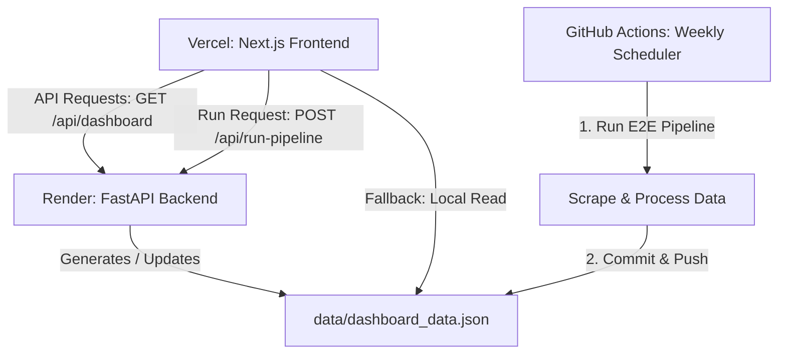

# Spotify AI-Powered Review Discovery Engine (PRDE) — Deployment Plan

This document outlines the step-by-step procedure to deploy the Spotify PRDE application. The architecture divides the system into two distinct deployments, combined with a scheduled runner for continuous data ingestion.

---

## 🏗️ Architecture Overview



1. **Frontend (Vercel)**: A serverless Next.js web application providing the interactive dark-themed dashboard and interactive console triggers.
2. **Backend (Render)**: A persistent python-based FastAPI service running on a Render Web Service. It manages the server-side pipeline executions, real-time logging streams, and serves structured JSON data.
3. **Weekly Data Sync (GitHub Actions)**: Since Render free tier has short execution timeouts and no persistent filesystem disk storage by default, the **GitHub Actions Weekly Workflow** runs on a scheduled Monday CRON to scrape new reviews, process them with spaCy and the LLM, and commit the final `dashboard_data.json` directly back to the GitHub repository. Next.js reads from this committed file as a fallback, guaranteeing 100% uptime and zero-latency loading.

---

## 🛠️ Step 1: Backend Deployment on Render

Render will host the FastAPI server (`src/server.py`).

### 1. Configure the Web Service (Using Render Blueprints)
The backend is configured via a Blueprints specification (`render.yaml`) using Render's native **Python 3** environment.

To deploy using the blueprint:
1. Log in to [Render](https://render.com/).
2. Click **Blueprints** → **New Blueprint Instance**.
3. Select your GitHub repository.
4. Render will read the `render.yaml` file automatically and provision a native Python web service named `spotify-prde-backend`.

Alternatively, to configure the **Web Service** manually:
*   **Name**: `spotify-prde-backend`
*   **Runtime**: `Python 3`
*   **Build Command**:
    ```bash
    pip install -r requirements.txt && playwright install chromium
    ```
*   **Start Command**:
    ```bash
    uvicorn src.server:app --host 0.0.0.0 --port $PORT
    ```

### 2. Environment Variables
In the Render Web Service settings, navigate to the **Environment** tab and add the following keys (if not using the Blueprint config):

| Key | Value | Description |
| :--- | :--- | :--- |
| `GROQ_API_KEY` | `gsk_...` | Your Groq API cloud key for LLM-based theme synthesis. |
| `PYTHONUNBUFFERED` | `1` | Ensures logs are sent instantly without delay to the frontend console stream. |
| `PYTHON_VERSION` | `3.11` | Configures Render to use the specified Python version runtime. |


> [!NOTE]
> Render's Free tier Web Services spin down after 15 minutes of inactivity. When a frontend user visits the dashboard, the first request may experience a **30–50 second delay** while the Render backend wakes up.

---

## ⚡ Step 2: Frontend Deployment on Vercel

Vercel will host the Next.js single-page application under `frontend/`.

### 1. Import Project to Vercel
Log in to [Vercel](https://vercel.com/), click **Add New** → **Project**, and select your GitHub repository.

### 2. Configure Directory Settings
Since the project contains both backend and frontend code, you must configure Vercel to target the frontend subdirectory:

*   **Root Directory**: `frontend` (Make sure to click "Edit" and choose the `frontend` folder)
*   **Build Command**: `next build` (Next.js default, configured automatically by `frontend/vercel.json`)
*   **Output Directory**: `.next` (Next.js default, configured automatically)

### 3. Configure Environment Variables
Under the **Environment Variables** section in Vercel, add:

| Key | Value | Description |
| :--- | :--- | :--- |
| `BACKEND_URL` | `https://spotify-prde-backend.onrender.com` | Replace with your live Render Web Service URL. |
| `DASHBOARD_DATA_PATH` | `../data/dashboard_data.json` | Path where Next.js fallback reads dashboard data (relative to `frontend/`). |

> [!TIP]
> The backend URL must **not** have a trailing slash (e.g., use `https://my-backend.onrender.com` and not `https://my-backend.onrender.com/`).

---

## 🤖 Step 3: Configure GitHub Actions Scheduler

The weekly scheduler runs automatically on GitHub's infrastructure and commits the generated output.

1. Ensure the `.github/workflows/weekly_pipeline.yml` file is committed to your `main` branch.
2. In your GitHub repository:
   * Navigate to **Settings** → **Secrets and variables** → **Actions**.
   * Click **New repository secret**.
   * Name: `GROQ_API_KEY`
   * Value: *Your Groq API key.*
3. Go to **Settings** → **Actions** → **General**:
   * Scroll down to **Workflow permissions**.
   * Select **"Read and write permissions"** (This is required to allow the workflow to commit the generated `dashboard_data.json` back to your repo).
   * Click **Save**.

---

## 🔍 Verification & Troubleshooting

### 1. Testing Backend Integrity
Once Render finishes deploying, visit the root URL:
`https://spotify-prde-backend.onrender.com/`

Expected response:
```json
{
  "status": "online",
  "service": "Spotify AI-Powered Review Discovery Engine (PRDE) Backend API",
  "version": "1.0.0"
}
```

### 2. Resolving CORS Issues
If you encounter browser console errors stating:
`Access to fetch at ... has been blocked by CORS policy`

The backend middleware in `src/server.py` is configured with `allow_origins=["*"]` by default. If your organization requires tighter security, replace `*` on line 18 of `src/server.py` with your custom Vercel domain:
```python
allow_origins=["https://spotify-prde-frontend.vercel.app"]
```

### 3. Handling Stream Timeouts
If Vercel serverless functions abort the log-stream because of a 10-second timeout, you should bypass Vercel's API route and let the browser talk directly to Render for the event stream. The frontend UI fallback can be configured dynamically to support direct client-side stream connection.
